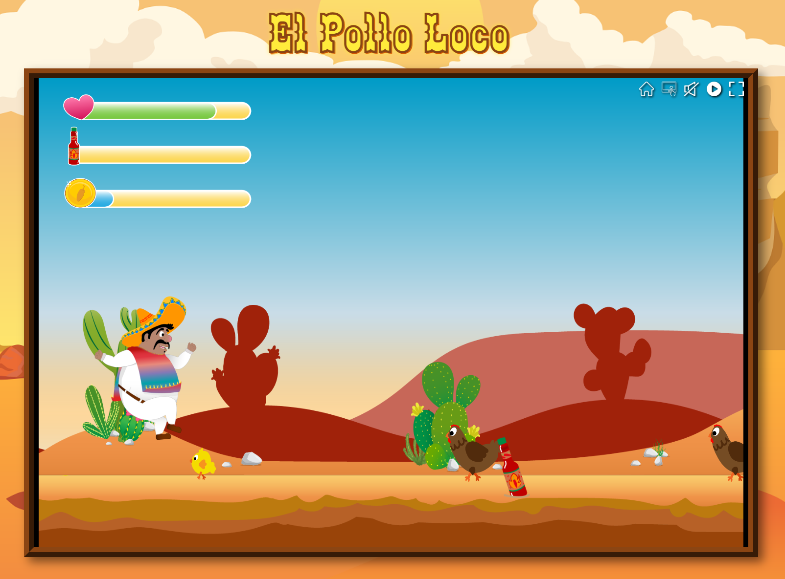

# 🐔 El Pollo Loco

A browser-based jump and run game built with vanilla JavaScript using object-oriented programming principles.

👉 **[Play the game](https://benjaminblarr.dev/el-pollo-loco/)**

## 🎮 About
El Pollo Loco is a challenging side-scrolling game where you face off against enemies – including a boss that shoots baby chickens. The game is designed with a deliberately high difficulty level that keeps players on their toes.

## ✨ Features
- Object-oriented architecture with vanilla JavaScript – no frameworks
- Custom sound effects, all created from scratch
- Dynamic boss fight mechanics
- Challenging gameplay with precise collision detection

## 🛠️ Technologies

