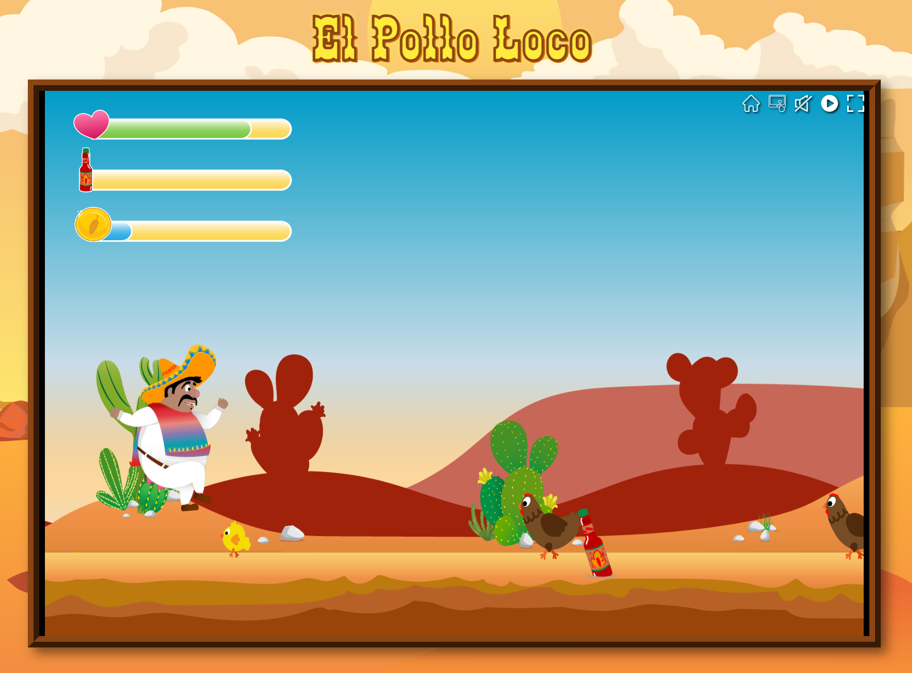

# El Pollo Loco

A side-scrolling jump and run game, written in plain JavaScript with an
object-oriented structure. No framework, no game engine, no build step.

👉 **[Play the game](https://benjaminblarr.de/el-pollo-loco/)**



## About

Pepe collects coins and bottles of tabasco salsa and uses them against the
chicken boss.

The part worth looking at is the structure behind it. Every moving thing, the
character, the enemies, the bottles, the clouds, inherits from one base class
that knows its position, its size and how to draw itself. On top of that runs a
single loop that clears the canvas many times per second and redraws
everything, applying gravity, animation states and collision checks on every
pass.

Sprites and world graphics are the assets that came with the project. The audio
is not: the original sound effects were weak, so I generated my own set with
ElevenLabs and kept only what still worked.

## Features

- Object-oriented architecture, 24 classes, 17 of them extending a shared base class
- Collision detection for enemies, bottles and collectibles
- Boss fight with its own state handling, alert, attack, hurt and death phases
- Four status bars: health, bottles, coins and a separate boss health bar
- Start screen, win and game over screens
- Playable on a phone: on-screen touch controls that can be toggled
- Fullscreen, pause and mute, own sound design and background music

## Controls

| Action       | Keyboard   | Touch            |
| ------------ | ---------- | ---------------- |
| Move left    | `←` or `A` | on-screen button |
| Move right   | `→` or `D` | on-screen button |
| Jump         | `Space`    | on-screen button |
| Throw bottle | `F`        | on-screen button |

The in-game menu adds fullscreen, pause, mute and a toggle for the touch
buttons. The interface itself is in German.

## Architecture

Two branches come off one base class. `DrawableObject` knows position, size and
how to draw itself, `MoveableObject` adds gravity, movement and collision.

```
DrawableObject
├── MoveableObject
│   ├── Character
│   ├── Chicken
│   ├── BabyChicken
│   ├── Endboss
│   ├── Cloud
│   ├── BackgroundObject
│   ├── ThrowableObject
│   └── CollectableObject
│       ├── Coin
│       ├── BottleOnGround
│       └── BottleInAir
└── StatusBar
    ├── HealthBar
    ├── BottleBar
    ├── CoinBar
    └── EndbossHealthBar
```

`World` owns the render loop and the collision checks. Four helpers sit beside
the hierarchy: `Level` holds the level layout, `Keyboard` tracks input state,
`AudioHub` and `ImageHub` preload and hand out assets, and `IntervalHub`
collects every running interval so the game can stop cleanly.

## Built with

<p align="left">
  
  
  
  
  
</p>

Rendering through the Canvas API. No dependencies, no build step.

## Getting Started

```bash
git clone https://github.com/B-Blarr/El-Pollo-Loco.git
```

Open `index.html` through a local web server, for example the Live Server
extension in VS Code. Opening the file directly works in most browsers, but a
server is the reliable way for the audio files.

## Credits

Sprites and world graphics by Developer Akademie. Interface icons from Flaticon
and Pixabay. Music and most sound effects generated with ElevenLabs.
